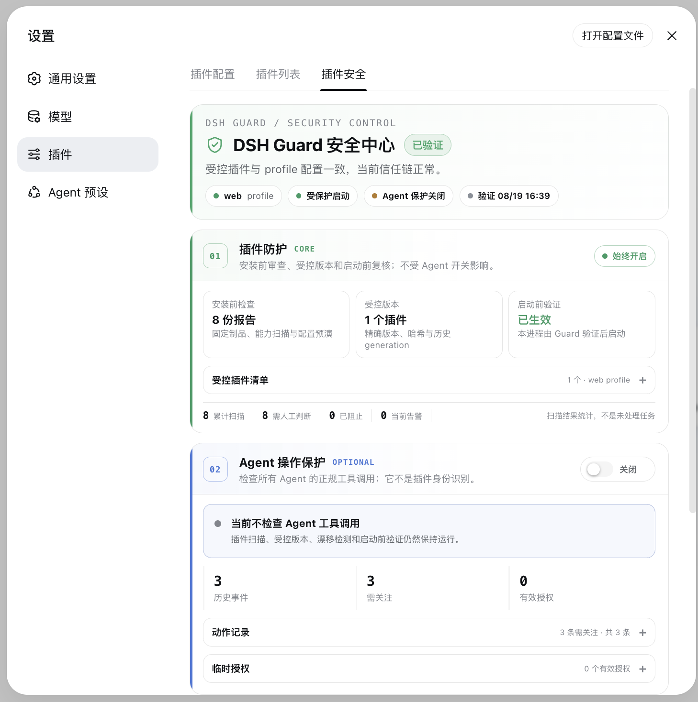

# DSH Guard

> 在第三方 DeepSeek Harness 插件获得本机权限之前，先看清它会做什么；安装以后，继续确认它没有被替换、篡改或绕过。

DSH Guard 是 DeepSeek Harness（DSH）的本地插件安全门。它把插件安装从“直接执行一个 npm 包”改成一条可检查、可批准、可验证、可回滚的流程。

当前版本是 **0.5.0-alpha.1（本地 Alpha）**，已在 **macOS、Node.js 22.22+、DSH 0.1.0-rc.7** 上验证。

## 界面预览



插件防护始终开启；Agent 操作保护独立可选，不会混淆两种安全边界。

## 先说人话：它解决什么问题？

DSH 的 Host 插件不是浏览器扩展。它会作为 Node.js 代码进入 DSH 进程，并继承当前用户的文件、环境变量和网络权限。

所以，安装一个来路不明的 DSH 插件，本质上接近于：

> 下载一段别人写的 Node.js 程序，然后让它以你的用户身份长期运行。

DSH Guard 在三个关键位置加门：

| 什么时候 | DSH Guard 做什么 | 你得到什么 |
| --- | --- | --- |
| 安装前 | 固定版本和哈希，扫描代码与依赖，在隔离 profile 中预演配置变化 | 知道插件来自哪里、想获得哪些能力、会修改什么 |
| 安装和更新时 | 只安装已批准的精确制品，保存备份与不可变 generation | 批准 A，就不会悄悄装成 B；失败可以恢复 |
| 每次启动前 | 核对 profile、插件清单和 generation；不一致就拒绝启动 | 插件被替换、偷偷加入或配置漂移时，不让 DSH 带病启动 |

DSH 内还会出现一个“插件安全”页面，用来显示当前状态、受控插件、漂移和告警。

## 已经实现的能力

- **安装前扫描**：支持公开 npm 包、本地目录和 `.tgz`；检查生命周期脚本、凭据访问、文件读写、网络、子进程、动态代码、原生模块、DSH 工具注册和 profile 覆盖。
- **可解释报告**：结果是 `pass`、`review` 或 `blocked`，并附带文件位置和能力证据，不只给一个模糊分数。
- **绑定审批**：审批同时绑定报告、制品哈希、目标 profile 和策略哈希；任何一项变化都必须重新扫描。
- **受控安装**：要求 DSH 停机，使用离线精确制品安装，核对 staging 结果，失败时尽力恢复操作前状态。
- **插件生命周期**：支持查看、更新、卸载、修复和回滚；每次成功变更都会生成不可变历史版本。
- **漂移检测**：发现 profile 文件变化、未纳管 bundle、插件被替换或 generation 不匹配。
- **受保护启动**：`dsh-guard start` 只有在验证通过后才创建 DSH 进程。
- **DSH Companion**：在设置页和侧栏显示安全状态，并提供持久高危告警。
- **可选 Agent 操作保护**：默认关闭；开启后检查所有 Agent 的正规工具调用。
- **实验性 macOS 整进程沙箱**：用 OS policy 同时限制 DSH Core、Agent 和所有插件。

## 它不是什么

DSH Guard 不会声称“扫描通过就绝对安全”。它目前也不是一个能隔离普通 Host 插件的完整沙箱。

这些边界必须分清：

- 静态扫描能发现危险能力和常见恶意模式，但不能证明任意 JavaScript 无害。
- Companion 与其他 Host 插件处在同一进程、同一权限级别，不是不可绕过的安全根。
- “Agent 操作保护”检查的是工具调用，不知道调用来自哪个 npm 插件；因此它会同时影响主 Agent 和其他 Agent。
- Host 插件直接调用 `fs`、`fetch` 或 `child_process` 时，不经过 Agent 工具门禁。
- 直接运行 `dsh web` 或 `npx @deepseek-ai/dsh web` 会绕过 DSH Guard 的启动前验证。
- 真正的强隔离需要 OS 沙箱、容器或上游 DSH Core 提供的 preflight / capability 边界。

## 快速开始

### 1. 准备开发版

```bash
git clone git@github.com:Vincentkovsky/dsh-guard.git
cd dsh-guard
pnpm install --ignore-scripts
pnpm build
pnpm exec dsh-guard doctor
```

如果 `dsh` 不在 `PATH`，指向已安装的 DSH 入口：

```bash
export DSH_BIN=/path/to/@deepseek-ai/dsh/lib/bin.js
```

如果希望直接使用 `dsh-guard` 命令，而不是每次写 `pnpm exec`：

```bash
cd packages/cli
npm link
cd ../..
```

### 2. 扫描插件

公开 npm 包：

```bash
dsh-guard scan some-plugin@1.2.3 --profile web
```

本地插件或已经下载的 tarball：

```bash
dsh-guard scan ./my-plugin --profile web
dsh-guard scan ./my-plugin-1.2.3.tgz --profile web
```

扫描不会因为插件“看起来正常”就自动批准。查看报告中的能力、证据和 staging 差异：

```bash
dsh-guard report <report-id>
```

### 3. 批准并安装精确制品

```bash
dsh-guard approve <report-id>
```

完全退出目标 DSH 进程后安装：

```bash
dsh-guard install <report-id>
```

批准只对这次报告绑定的制品、profile 和策略有效。包版本、内容、profile 或策略变化后，旧审批不能复用。

### 4. 用 Guard 启动 DSH

```bash
dsh-guard start --profile web -- --host 127.0.0.1 --port 8080
```

启动器会在创建 DSH 进程前验证受管 generation，并在 spawn 前再核对一次 fingerprint。以下情况会失败关闭：

- profile 尚未纳管；
- 插件或配置发生漂移；
- 出现未纳管 bundle；
- 上一次操作进入 `needs-repair`；
- 启动参数试图覆盖 profile、patch 或 loader config；
- 验证通过后、进程创建前文件再次变化。

启动成功后访问 DSH Web，打开：

```text
设置 → 插件 → 插件安全
```

侧栏底部也会显示 DSH Guard 盾牌和当前状态。

## 日常使用

每次启动建议只用：

```bash
dsh-guard start --profile web -- --host 127.0.0.1 --port 8080
```

随时检查 profile：

```bash
dsh-guard verify --profile web
```

查看当前插件和历史 generation：

```bash
dsh-guard plugins list --profile web
dsh-guard plugins history --profile web
```

更新插件不会自动寻找“最新版”。先扫描并批准明确版本，再更新：

```bash
dsh-guard scan some-plugin@2.0.0 --profile web
dsh-guard approve <report-id>
# 完全退出 DSH
dsh-guard plugins update <report-id>
```

卸载、修复和回滚会改写 profile，因此命令要求精确重述目标：

```bash
# 完全退出 DSH
dsh-guard plugins uninstall some-plugin --profile web --confirm some-plugin
dsh-guard plugins repair --profile web --confirm web
dsh-guard plugins rollback --profile web --to <generation-id> --confirm <generation-id>
```

如果 profile 已经漂移，rollback 默认拒绝继续。只有审阅并确认操作前备份后，才应使用 `--allow-drift`。

## 安装 Companion 本身

安全插件不能自我声明可信。Companion 也要经过同一套扫描、审批和安装流程：

```bash
dsh-guard scan ./packages/dsh-plugin --profile web
dsh-guard report <report-id>
dsh-guard approve <report-id>
# 完全退出 DSH
dsh-guard install <report-id>
```

Companion 通常会得到 `review`，因为它确实需要读取本地 Guard 状态、注册同源 Host API 并接入 DSH UI。这是能力披露，不等于恶意判定。

## Agent 操作保护为什么默认关闭？

这个开关保护的是 **所有 Agent 的工具调用**，不是只保护第三方插件。

开启后，主 Agent 的文件读取、写入、Bash、Web 和传输类工具都会经过 `allow / ask / deny` 策略。它能阻止常见的凭据读取、危险 shell 和敏感外传，但也可能影响正常工作流。

因此默认策略是：

- 插件扫描、受控安装、生命周期、漂移检测和启动保护始终工作；
- Agent 操作保护默认关闭，由用户在安全中心显式开启；
- 开启或关闭立即生效，不需要修改 DSH profile 或重启；
- 关闭时撤销当前 profile 的临时授权，但保留脱敏历史事件；
- 选择按 profile 保存到 `~/.dsh-guard/action-protection.json`。

操作位置：

```text
设置 → 插件 → 插件安全 → Agent 操作保护
```

如果状态文件损坏或权限异常，运行时会失败关闭为“开启保护”，并在页面显示降级原因。

注意：DSH 自己的默认安全策略与 DSH Guard 相互独立。关闭这个开关，不代表 DSH 会允许读取 SSH 私钥等已知凭据路径。

## 高危告警

Companion 只为需要立即注意的事件弹出持久告警，例如：

- 已验证 profile 变成 drifted；
- 出现新的未纳管插件或 bundle；
- 受保护配置发生变化；
- 安装恢复失败，profile 进入 `needs-repair`；
- Agent 操作保护开启时，本地策略、授权或审计状态降级；
- Agent 操作保护开启时，critical 动作被阻止或短时间重复触发高风险拒绝。

“知道了”只会确认告警，不会把风险标记为已修复。安全中心不会提供绕过扫描的一键“信任”或“安装”按钮。

## 实验性 macOS 整进程沙箱

普通 Companion 不能隔离同进程插件。需要更强边界时，可以先查看沙箱计划：

```bash
dsh-guard sandbox plan \
  --profile web \
  --workspace /absolute/project \
  --network loopback
```

确认后从一次性 verified profile 副本启动：

```bash
dsh-guard sandbox run \
  --profile web \
  --workspace /absolute/project \
  --network loopback \
  -- --port 8080
```

网络模式：

- `deny`：禁止 outbound；
- `loopback`：只允许本机 TCP；
- `unrestricted`：必须显式选择，并会显示数据外传警告。

这是实验能力，不是默认启动方式。它依赖 Apple 已 deprecated 的 `sandbox-exec`，不会复制 `~/.dsh/.credentials.yaml`，并会阻止 `/bin/sh` 等未显式允许的 executable；因此模型认证或 Bash 工具可能不可用。

## 本地数据与隐私

所有 Guard 状态默认保存在 `~/.dsh-guard`：

```text
~/.dsh-guard/
├── reports/                         # 扫描报告
├── approvals/                       # 绑定审批
├── installs/                        # 当前安装记录
├── managed-profiles/                # 受管 profile 元数据
├── generations/<profile>/<id>/      # 不可变历史 generation
├── cache/                            # 已固定的离线制品
├── backups/                          # 操作前备份
├── audit.jsonl                       # 管理操作审计
├── events.jsonl                      # 插件安全事件
├── action-policy.json                # Agent 动作策略
├── action-protection.json            # 每个 profile 的开关
├── action-grants.json                # 临时授权
└── action-events.jsonl               # 脱敏动作事件
```

目录权限为 `0700`，状态文件为 `0600`。动作日志只保存 profile/session、资源摘要、参数 digest、规则和结果，不保存完整工具参数、文件内容或工具输出。

Companion Host API 只在 DSH Web 绑定 loopback 时注册。若使用 `0.0.0.0`，安全中心会显示断开，不会把本地安全数据暴露到局域网。

## 退出码

扫描与策略命令使用稳定退出码，方便接入 CI：

| 退出码 | 含义 |
| --- | --- |
| `0` | 通过 / allow |
| `2` | 需要人工审查 / ask |
| `3` | 阻止 / deny |
| `4` | 输入、运行时或兼容性错误 |
| `5` | profile 需要修复 |

`pass` 只表示当前规则没有发现违规，不是安全证明。

## 开发与验证

```bash
pnpm check
pnpm test:sandbox
```

完整 E2E 会在临时 sibling `DSH_HOME` 和临时 Guard state 中完成扫描、审批、安装、Host API、生命周期和沙箱验证，不修改真实 `~/.dsh/profiles/web`：

```bash
DSH_NODE=/path/to/node-22.22-or-newer \
DSH_BIN=/path/to/@deepseek-ai/dsh/lib/bin.js \
pnpm test:e2e
```

## 常见问题

### 为什么 DSH 里看不到“插件安全”？

先确认 Companion 已经过 Guard 安装，然后完全重启 DSH。入口位于 `设置 → 插件 → 插件安全`，侧栏底部也应出现盾牌。

### 为什么页面显示“未受保护启动”？

当前进程不是由 `dsh-guard start` 创建。退出后改用：

```bash
dsh-guard start --profile web -- --host 127.0.0.1 --port 8080
```

### 为什么允许一次后仍然读不了 SSH 私钥？

已知凭据路径还可能被 DSH 自己的默认策略拒绝。DSH Guard 的审批不会覆盖 DSH Core 的硬性保护。

### 为什么绑定 `0.0.0.0` 后安全中心断开？

这是预期行为。Companion 的本地状态 API 只允许 loopback，避免把扫描报告、插件状态和审计信息暴露给局域网。

## 文档

- [安全模型](./docs/security-model.md)
- [插件优先产品边界设计](./docs/plans/2026-08-19-dsh-guard-plugin-first-product-design.md)
- [Guarded Launch 设计](./docs/plans/2026-08-19-dsh-guard-guarded-launch-design.md)
- [Agent 操作保护开关设计](./docs/plans/2026-08-19-agent-action-protection-toggle-design.md)
- [插件生命周期运行手册](./docs/runbooks/2026-08-19-v0.3-local-alpha.md)
- [Guarded Launch 运行手册](./docs/runbooks/2026-08-19-v0.5-guarded-launch.md)
- [实验性 macOS Sandbox 运行手册](./docs/runbooks/2026-08-19-v0.4-experimental-sandbox.md)

## License

[MIT](./LICENSE)
