# DSH Guard 完整设计文档

> 状态：v1 设计基线（与 2026-08-19 本地实现对齐）
> 目标环境：DeepSeek Harness `0.1.0-rc.6`、macOS、Node.js `22.22+`
> 文档用途：架构评审、安全评审、开发验收和后续版本决策

## 1. 摘要

DSH Guard 是 DeepSeek Harness（DSH）第三方插件的本地供应链闸门。它在候选插件进入真实 DSH profile 之前，把来源解析、制品固定、静态能力分析、目标 profile 兼容性预演、人工审批和离线安装串成一个可审计流程；安装后再通过 profile 指纹和 DSH 内嵌 Companion 提供漂移检测、状态展示、严重告警与按精确工具名执行的纵深策略。

系统采用“双层产品”架构：

- 进程外 CLI 是主要安全边界，负责 `scan → approve → install → verify`。
- 进程内 Companion 是可见性和 defense-in-depth 层，不能被视为插件沙箱或可信根。

设计的核心不变量是：

1. 候选代码在批准前不被 import、eval 或执行。
2. 生命周期脚本在扫描、staging 和真实安装中始终关闭。
3. 审批绑定确切 artifact、完整报告、目标 profile 和 policy 哈希。
4. 真实安装结果必须与隔离 staging 的提案完全一致。
5. `pass` 只表示当前规则未发现违规，不表示“插件安全”。

## 2. 背景与问题

DSH 宿主插件本质上是与 DSH 同进程、同操作系统用户权限运行的 Node.js 代码。一个恶意或被接管的插件可能读取用户文件和环境变量、访问网络、创建子进程、修改 profile，或者绕过另一个普通插件提供的 Hook。DSH 的 agent sandbox 不能自动成为第三方宿主插件的安全边界。

用户当前缺少四个控制点：

- 安装前不知道 npm 包或本地插件实际包含哪些文件和能力。
- 扫描对象与最终安装对象可能不是同一制品。
- 插件对具体 profile 的依赖解析和 DSH patch 结果没有被预演。
- 安装后 profile 被原生命令或人工修改时，没有统一的漂移状态和告警。

DSH Guard 解决这些控制点，但不承诺完备恶意代码检测，也不承诺在任意恶意插件已经执行后仍保持可信。

## 3. 目标、非目标与成功标准

### 3.1 目标

- 接受 public npm spec、本地目录和本地 `.tgz`，生成内容固定的候选 artifact。
- 在不执行候选代码的前提下，输出可解释、可定位、可复现的能力报告。
- 在目标 profile 的克隆中完成依赖安装和 DSH 配置组合预演。
- 用显式审批把 artifact、报告、policy 和 profile 状态绑定起来。
- 在目标 DSH 停止运行时，执行离线、禁脚本、精确制品安装。
- 安装后重新计算 profile 状态，发现漂移和未纳管 bundle。
- 在 DSH 内提供只读安全中心、状态盾牌和仅严重事件告警。
- 为高风险工具提供精确工具名 `deny` / `ask` 纵深策略。

### 3.2 非目标

- 证明插件无漏洞、无后门或无恶意逻辑。
- 在同用户权限下隔离已运行的恶意 Host 插件。
- 动态执行、沙箱运行或自动修复恶意 native addon。
- 依靠 LLM 决定是否放行、批准或安装。
- v1 支持 Git/HTTP tarball、private registry、npm alias、`file:`/`link:`/workspace spec。
- v1 支持 Windows、Linux 或 DSH rc.6 之外版本。
- v1 实现团队账号、云端信誉库或中心化策略服务。

### 3.3 v1 成功标准

- 同一目录内容重复打包得到同一 SHA-256。
- 越界 symlink、tar path traversal、identity/integrity 不一致被阻止。
- 风险插件得到 `review`，受保护 profile 覆盖得到 `blocked`。
- profile 或 artifact 在 scan 后变化时，审批或安装失效。
- staging 与真实安装的 lock hash 和 profile fingerprint 一致。
- 完整隔离 E2E 达到 `review → approve → install → Host API → verified`。
- Companion 不提供批准、信任或安装入口。
- 所有安全边界和未解决问题在用户文档中明确披露。

## 4. 方案比较与选择

### 4.1 纯 DSH 安全插件

优点是安装简单、体验统一；缺点是它与被检查插件同权，无法约束安装脚本、直接 Node.js API 调用或自身被禁用。该方案不能成为可靠可信根，因此不采用。

### 4.2 OS 沙箱启动器优先

优点是可以形成更强的文件、网络和进程边界；缺点是平台差异大、与 DSH GUI 生命周期耦合重，不适合作为首个可验证版本。保留为后续高保障模式。

### 4.3 外部安装闸门 + 内嵌 Companion（选择）

该方案把强制控制放在候选插件执行之前，同时保留 DSH 内的可见性和告警体验。它不能解决所有运行时隔离问题，但每一层的安全声明与实际权限一致，适合 v1。

## 5. 威胁模型

### 5.1 受保护资产

- DSH profile 的 manifest、lockfile、workspace 设置和 Cordis 配置。
- 用户文件、环境变量、令牌、API keys 和开发凭据。
- 插件审批记录、扫描证据、安装基线和审计日志。
- DSH 工具执行策略和用户对安全状态的正确理解。

### 5.2 对手与故障

- 发布恶意 npm 包、typosquat 包或被接管版本的攻击者。
- 利用生命周期脚本、归档路径、symlink、动态代码或 native addon 的包。
- 在 scan、approve、install 之间替换 artifact 或修改 profile 的 TOCTOU。
- 已安装插件、原生 `dsh plugin` 命令或手工编辑造成的未纳管变化。
- 安装中断、锁文件漂移、依赖解析差异和恢复失败。
- 恶意 finding 文本或事件证据对用户/Sidecar 进行提示注入。

### 5.3 信任假设

- DSH Guard 启用前，当前用户环境尚未被任意代码执行型插件完全攻陷。
- Node.js、DSH CLI、pnpm、操作系统和 npm 官方 registry 的 TLS/本机运行时属于基础信任。
- 用户会在人工审查后显式批准，并在真实安装前停止目标 DSH profile。
- `~/.dsh-guard` 的 `0700/0600` 只隔离其他系统用户，不抵御同用户恶意进程。

### 5.4 安全边界

| 边界 | 能保证什么 | 不能保证什么 |
|---|---|---|
| CLI artifact pipeline | 候选输入固定、校验、禁脚本 | 发现所有恶意逻辑 |
| 隔离 staging | 在目标 profile 语义下预演依赖与配置 | 提供 OS 级恶意代码隔离 |
| 审批绑定 | 防止常见 artifact/profile/policy TOCTOU | 防止同用户同时篡改代码和记录 |
| 真实安装 | 离线、禁脚本、结果与提案比对 | 跨文件系统原子事务 |
| Companion | 状态、告警、精确工具名策略 | 约束插件直接调用 Node.js API |
| Sidecar | 只读解释结构化证据 | 成为裁决者或可信分析沙箱 |

## 6. 总体架构

```mermaid
flowchart LR
  S["npm spec / local dir / .tgz"] --> R["Source Resolver"]
  R --> A["Content-addressed Artifact Cache"]
  A --> X["Safe Extractor"]
  X --> P["Static Scanner + Policy"]
  P --> G["Target-profile Staging"]
  G --> Q["Scan Report"]
  Q --> H["Explicit Approval"]
  H --> I["Offline Installer"]
  I --> V["Verifier"]
  V --> E["Events / Status"]
  E --> C["DSH Companion"]
  C --> U["Security Center / Shield / Alerts"]
```



### 6.1 Monorepo 组成

| 包 | 责任 | 不承担的责任 |
|---|---|---|
| `@dsh-guard/core` | 来源解析、归档校验、扫描、staging、审批、安装、验证、状态 | UI、云端服务 |
| `dsh-guard` | CLI 命令、输出与退出码 | 重新实现核心安全逻辑 |
| `@dsh-guard/companion` | Host 状态、事件、工具策略、Sidecar、三个 UI slot | 批准、安装、可信裁决 |

## 7. 核心工作流

### 7.1 Scan

1. 读取目标 profile 的五个控制文件并计算 fingerprint。
2. 解析输入来源：
   - npm spec 固定到精确版本，校验 registry identity 和 SHA-512 integrity/SHA-1 shasum；
   - 本地目录按 `npm-packlist` 排序打包，拒绝越界 symlink，固定 mtime；
   - 本地 tarball 读取并校验 `package/package.json` identity。
3. 将制品复制到 SHA-256 内容寻址缓存。
4. 在解压前检查压缩包大小、条目数、展开预算、路径和 link target。
5. 解压普通文件，记录每个文件的 size 和 SHA-256。
6. 扫描 manifest、所有 JS/TS/JSX/TSX 源文件与 DSH patch。
7. 在目标 profile 克隆中完成 staging，并记录 proposed lock/config/profile。
8. 汇总 finding，计算 `pass/review/blocked`，保存不可变报告快照。

当前扫描深度需要准确理解：v1 对候选根包内的源文件做完整 AST 扫描；`dependencyGraph` 记录 manifest 声明的运行时/可选依赖，staging 验证最终解析图是否可安装，但尚未对所有传递依赖内容做同等深度扫描。

### 7.2 Approve

审批前重新计算：

- 当前 profile fingerprint；
- artifact SHA-256；
- 完整报告 digest；
- policy hash。

`blocked` 不可批准，v1 没有 `--force`。审批是一次性绑定，不是对包名或发布者的永久信任。

### 7.3 Install

1. 重新验证报告、审批、policy、artifact 和 profile。
2. 检查目标 DSH profile 是否正在运行。
3. 以 `O_EXCL` 获取 profile 独占锁。
4. 备份 profile 控制文件。
5. 从预热 store 执行 `--offline --save-exact --ignore-scripts` 安装。
6. 重新计算 lock hash 和 profile fingerprint。
7. 仅当结果与 staging proposal 一致时写入安装基线。
8. 失败时尽力恢复；恢复失败进入 `needs-repair` 并保留备份。

恢复是 best effort，不宣称 node_modules/store 与多文件更新具有原子事务语义。

### 7.4 Verify

`verify` 重新读取真实 profile，不只信任本地状态。它比较当前 fingerprint、最后一次受控安装基线和 bundle 集合，返回：

- `verified`：与最近一次受控基线一致；
- `drifted`：profile 文件变化或出现未纳管 bundle；
- `unknown`：没有该 profile 的受控安装记录；
- `needs-repair`：安装失败且恢复未完成；
- `review`：保留给需要人工处理但尚未形成可信基线的状态。

当前 `installs/<profile>.json` 表示“该 profile 最近一次受控安装后的整体基线”，UI 的 managed package 也只展示该记录对应的最近包。多包逐项历史与逐包状态属于 beta 前数据模型升级。

## 8. 静态分析与裁决

### 8.1 能力分类

- 文件读取、文件写入
- 环境变量与凭据
- 网络客户端、网络监听
- 子进程
- 动态代码、worker/cluster 等外部代码
- native code 依赖
- DSH 工具注册
- DSH profile / protected entry 覆盖

### 8.2 Finding 分级

| 等级 | 语义 | 示例 |
|---|---|---|
| `blocked` | 不可覆盖的身份、完整性、兼容性或策略违规 | path traversal、identity mismatch、protected entry override |
| `review` | 能力真实但需要用户理解 | network、subprocess、credentials、lifecycle script |
| `info` | 记录证据，不改变 verdict | 后续供应链元数据扩展 |

裁决取最高严重级别。规则必须确定、可复现；不得把模型结论直接映射为 `blocked` 或 `pass`。

### 8.3 Patch 分析

- YAML 层仅做词法/CST 检查，不执行 `!!js`。
- protected entry/module 引用由确定性规则阻止。
- 有效 DSH 配置差异由 staging 中的上游 `dsh --dump-config` 计算。

## 9. 数据模型与本地状态

### 9.1 关键对象

- `ResolvedSource`：来源类型、精确 name/version、artifact path/hash、registry integrity。
- `ScanReportV1`：policy、verdict、profile snapshot、文件表、finding、stage proposal。
- `ApprovalV1`：report/artifact/profile/policy 四重绑定。
- `InstallRecordV1`：最近一次 profile 基线和最近受控包。
- `GuardEventV1`：高危事件、稳定 fingerprint、确认状态。
- `GuardStatusSnapshotV1`：给 CLI/UI 的裁剪状态。

所有持久对象包含 `schemaVersion`。在修改字段含义前必须新增 schema 版本和迁移/拒绝策略，不能静默复用 v1。

### 9.2 目录

```text
~/.dsh-guard/
├── reports/
├── approvals/
├── installs/
├── cache/artifacts/
├── cache/pnpm-store/
├── locks/
├── backups/
├── audit.jsonl
├── events.jsonl
└── status.json
```

状态文件是 tamper-evident 辅助记录，不是对同用户攻击者防篡改的数据库。

## 10. Companion 与前端

### 10.1 Host

Companion 只在 DSH web server 明确绑定 `127.0.0.1` 时注册 API：

- `GET /dsh-guard/api/status`
- `POST /dsh-guard/api/acknowledge`
- `POST /dsh-guard/api/analyze`

POST 要求同源 loopback `Origin`，body 最大 64 KiB；响应使用 JSON、`no-store` 和 `nosniff`。所有错误和证据在返回前裁剪、控制字符清理与常见 secret 模式脱敏。

### 10.2 三层 UI

| UI | DSH slot | 用途 |
|---|---|---|
| 安全中心 | `settings.plugins.tab` | 基线、报告统计、受控包、事件和 CLI 操作提示 |
| 状态盾牌 | `sidebar.footer.action` | 随时显示总体状态并打开 Quick View |
| 告警栈 | `shell.overlay` | 最多展示最近 3 个未确认严重事件 |

“知道了”只确认告警，不把风险改为已解决。UI 不提供批准、信任、强制放行或安装按钮。

### 10.3 严重事件

- `verified-to-drifted`
- `unmanaged-plugin`
- `protected-config-changed`
- `needs-repair`
- `repeated-tool-denial`

事件按稳定 fingerprint 去重；确认后同一风险未来再次发生可以生成新的活动事件。

## 11. Runtime policy 与 Sidecar

### 11.1 工具策略

- `denyTools` 通过单调 `ctx.tools.guard()` 拒绝精确工具名。
- `askTools` 在 `tools/pre-execute` 返回 `ask`。
- 60 秒内同一 deny 工具达到 3 次时生成高危事件。
- 不根据推断出的 npm 包来源执行强制策略，因为 rc.6 没有可靠的工具 provenance。

这只覆盖通过 DSH Tool Registry 执行的调用，不能拦截插件直接使用 `fs`、`fetch` 或 `child_process`。

### 11.2 Sidecar

Sidecar 只在用户点击“查看详情”时创建：

- 工具 allowlist 为空；
- 输入仅包含裁剪、脱敏、结构化事件字段；
- 提示明确把字段视为 inert data；
- 输出必须符合 `SidecarAnalysisV1`；
- 输出只能解释风险、检查项和限制，不能改变 verdict。

后续硬化必须增加超时、取消和资源上限；当前“无工具”是能力收缩，不是针对同进程恶意代码的沙箱。

## 12. 错误处理与恢复

| 阶段 | 失败策略 | 退出/状态 |
|---|---|---|
| 来源解析/下载 | 不缓存未校验制品 | runtime error `4` |
| 归档校验 | 立即终止，不解压不安全条目 | blocked `3` 或 runtime `4` |
| 静态扫描 | 根入口不可解析则 blocked；普通源文件不可解析则 review | `2/3` |
| staging | 未尝试为 review，尝试后不兼容为 blocked | `2/3` |
| approve | 任一绑定变化则要求 rescan | runtime `4` |
| install | 停机、锁、离线和提案一致性均 fail closed | `4` |
| restore | 保留备份并生成高危事件 | needs-repair `5` |
| Companion API | 返回裁剪错误，不暴露内部堆栈 | HTTP `4xx/5xx` |
| Sidecar | 丢弃不合 schema 的输出，不降级自由文本 | UI 局部失败 |

## 13. 测试策略

### 13.1 单元/构建测试

- 确定性目录打包和 packlist 行为。
- 生命周期脚本不执行。
- symlink、tar path/link escape 和展开预算。
- AST 能力、lifecycle、protected entry、缺失入口与 client exports。
- profile/artifact/policy/report 审批失效。
- 事件 fingerprint 去重与确认。
- client bundle 的三个 slot、Host API 路径和无高风险 UI 动作。
- Sidecar 无工具与 loopback-only Host 契约。

### 13.2 集成/E2E

- 从真实 web profile 复制五个控制文件到隔离 home。
- 扫描 Companion，确认 verdict 为 `review` 且 staging compatible。
- approve/install 后启动临时 DSH Host，读取 status API。
- verify 返回 `verified`，并确认 bundle 被加入 profile。
- 所有临时路径在清理前验证安全前缀，不修改真实 profile。

### 13.3 发布门槛

- `pnpm check` 全绿。
- 12 个现有测试全绿，并为每个新 blocker/恢复分支添加回归测试。
- 隔离 E2E 在 Node `22.22+` 与目标 DSH rc.6 通过。
- 真实 DSH 页面完成安全中心、盾牌、Quick View、告警、键盘与 reduced-motion QA。
- 安全模型、设计文档、开发计划、README 与实现没有相互矛盾的声明。

## 14. 兼容性与版本策略

- v1 锁定 DSH `0.1.0-rc.6`；升级时重新做 Host、client loader、UI slots、tools API、`dump-config` 和 E2E compatibility spike。
- 所有 workspace package 的 engine 应统一为真实验证下限 `>=22.22.0`。
- 报告、审批、安装记录、事件和状态分别独立版本化。
- policy ID/hash 变化使已有审批失效。
- 不通过放宽 peer range 来“声明兼容”。

## 15. 已知限制与待决策

### 15.1 v1 已接受限制

- 只深扫候选根包，不对全部传递依赖做等深 AST 分析。
- registry 固定为 public npmjs；无 private registry/auth。
- profile 状态以最近一次整体基线为主，未形成逐包 inventory 历史。
- 备份/恢复不覆盖完整 node_modules 事务。
- 运行中 profile 检测依赖 macOS `ps` 启发式。
- Companion 状态计算与 core 有重复逻辑，存在长期漂移风险。
- Sidecar 尚缺显式超时和取消。

### 15.2 beta 前必须决策

- 多插件 inventory 是以 profile generation 还是 package ledger 为主模型。
- update/remove 是否复用“新 generation 提案”，避免增加另一个事务协议。
- 传递依赖扫描采用 lock diff 风险聚合还是可达入口扫描。
- `repair` 是只生成命令/诊断，还是执行受控恢复。
- 是否发布 npm 包，还是先保持本地开发工具。

## 16. 设计验收清单

- [ ] 安全声明没有把 Companion、文件权限或 Sidecar描述成强沙箱。
- [ ] 每个安装输入在批准前都已变成内容寻址 artifact。
- [ ] 每个可批准报告都绑定目标 profile 和成功 staging。
- [ ] 每个真实安装都与 staged proposal 做结果一致性验证。
- [ ] 任何 `blocked` 都不能通过 UI 或 `--force` 绕过。
- [ ] UI 仅展示和确认，不进行批准/安装。
- [ ] 新 schema、新 DSH 版本和新平台都有明确迁移/兼容流程。
- [ ] 多插件、修复、Sidecar 超时等当前缺口在开发计划中有对应任务。
