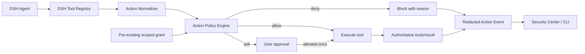

# DSH Guard v2 产品与架构设计

> 状态：已确认的 v0.2 目标设计
> 日期：2026-08-19
> 首发用户：在本机使用 DeepSeek Harness 的单个开发者
> 当前实现基线：v0.1 Trust Gate，提交 `3bf7365`

## 1. 用一句话解释产品

DSH Guard 是给 DSH Agent 使用的本地权限管家：安装插件前检查它会获得什么能力，Agent 执行高风险操作前决定允许、询问还是阻止，执行后留下可解释记录。

它不是通用杀毒软件，也不判断 Agent “是否善良”。它只保护两个明确时刻：

1. 候选插件进入真实 DSH profile 之前。
2. Agent 通过 DSH 正规工具产生本地或外部效果之前。

用户的核心任务是：

> 当我把文件、命令、网络和凭据交给 Agent 使用时，我需要让正常工作保持顺畅，同时在删除、越界读取、执行程序和数据外发发生前获得可靠控制。

## 2. 当前基础与 v0.2 增量

### 2.1 已有的 v0.1 Trust Gate

当前代码已经实现并验证：

- 固定 npm、本地目录或 `.tgz` 为不可变 artifact。
- 在不执行候选代码和生命周期脚本的情况下扫描能力。
- 在目标 profile 克隆中完成隔离 staging。
- 把审批绑定到报告、artifact、profile 和 policy 哈希。
- 离线、禁脚本、精确安装，并验证结果与 staging proposal 一致。
- 检测 profile 漂移、未纳管 bundle 和安装恢复失败。
- 通过 Companion 展示状态、告警和精确工具名 `deny` / `ask`。

这些能力继续保留，不在 v0.2 中重写。

### 2.2 v0.2 新增的 Action Gate

v0.2 把精确工具名规则升级为上下文相关的操作策略：

- 把不同 DSH 工具调用标准化为 `ActionRequest`。
- 根据工具、参数、资源、任务授权和敏感目标作出 `allow / ask / deny`。
- 复用 DSH 的“仅本次允许”；保留严格的任务授权 schema，但在 rc.6 缺少可靠 task ID 时不启用任务授权。
- 在操作完成后记录实际结果和裁决链。
- 在安全中心显示最近操作和当前有效授权。

## 3. 产品目标、非目标与成功标准

### 3.1 目标

- 普通本地开发操作默认安静通过。
- 高风险操作在产生效果前被确定性策略评估。
- 审批界面展示具体命令、路径、域名和影响，而不是抽象风险分。
- 用户授权具有对象、范围和有效期，不形成永久信任。
- 每次允许、询问、阻止和执行结果都能被解释。
- 复用 DSH 的 approval、sandbox 和工具事件接口，不重新实现 Harness。
- 所有计划能力与已实现能力在文档和 UI 中严格区分。

### 3.2 v0.2 非目标

- 阻止宿主插件直接调用 Node.js `fs`、`fetch` 或 `child_process`。
- 抵御已经获得同用户任意代码执行能力的恶意进程。
- 企业账号、RBAC、中心化策略、云端信誉库或 SIEM。
- Windows/Linux、多主机和远程执行环境。
- 完整的数据丢失防护、语义意图证明或所有 Prompt Injection 检测。
- 由 LLM 自动批准、自动信任或改变确定性裁决。
- 新建常驻 daemon、网络代理、Secret Broker 或 OS 沙箱。

### 3.3 v0.2 成功标准

- 正常编码基准流程不产生高频审批。
- 读取凭据目录和疑似密钥文件能够被询问或阻止。
- 越界删除和高影响覆盖能够被阻止。
- 未授权的网络目标和明显的敏感参数外发能够被阻止。
- 审批准确展示被批准的操作范围。
- Guard 异常时，高风险操作 fail closed，低风险操作按安全默认继续并记录降级。
- 全部 Action Event 默认脱敏，不持久化文件内容、密钥或完整工具输出。

## 4. 方案比较与选择

### 4.1 继续扩展精确工具名列表

实现最简单，但无法区分 `fs.read` 读取源码和读取 SSH 私钥，也无法区分安全命令和危险命令。该方案只适合作为兼容回退，不作为 v0.2 核心。

### 4.2 直接建设进程外 Guard

可以形成更强的文件、网络和进程边界，但需要解决 DSH 生命周期、平台差异、凭据代理和执行世界替换。它是长期正确方向，不适合作为当前最小增量。

### 4.3 在正规工具调用路径上建设 Action Gate（选择）

该方案复用 DSH `tools/pre-execute`、权威 `tools/result` 和 approval 机制，能够快速验证用户是否需要“操作前解释与控制”。它不能形成恶意插件隔离边界，但可以在不重写现有 Trust Gate 的前提下提供明确增量价值。

## 5. 威胁模型

### 5.1 受保护资产

- 工作区和工作区外的用户文件。
- SSH key、`.env`、云凭据、浏览器数据和开发令牌。
- Shell、子进程和下载后执行能力。
- 网络发送目标和外部系统中的不可逆操作。
- 用户对当前任务授权范围的正确理解。
- Action policy、grant 和 event 的完整语义。

### 5.2 v0.2 覆盖的风险

- Agent 误删、越界写入或批量覆盖文件。
- Agent 在非必要场景读取敏感路径。
- Agent 执行高风险 Shell 或下载后执行链。
- Agent 向未授权域名发送疑似敏感参数。
- 用户在模糊审批提示中错误放行。
- 已过期授权继续生效。
- 工具或策略异常导致高风险操作错误放行。

### 5.3 明确未覆盖的风险

- 宿主插件绕开 Tool Registry，直接调用 Node.js API。
- 原生扩展、同用户恶意进程或已攻陷 DSH Host 篡改本地状态。
- 工具谎报或隐瞒其真实副作用。
- 仅靠参数无法识别的编码、分片或间接数据外传。
- 多 Agent 的强身份、委托证明和跨进程不可抵赖。

这些限制必须出现在 README、安全中心和相关事件中，不能用“运行时防护”一词掩盖覆盖范围。

## 6. 设计原则与安全不变量

1. **确定性规则裁决。** LLM 只能解释，不得放行。
2. **具体效果优先。** 审批展示参数和目标，不展示空泛风险分。
3. **最小授权。** grant 默认仅一次；任务授权必须有范围和过期时间。
4. **高风险失败关闭。** 无法分类、策略异常或审批不可用时不执行高风险操作。
5. **低风险保持可用。** 明确低影响操作可按默认策略继续，并记录 Guard 降级。
6. **计划与事实分离。** pre-execute 作出请求裁决，权威 `tools/result` 记录最终结果；缺失结果由超时记录为 `unknown`。
7. **不保存秘密。** 只持久化判断所需的脱敏元数据和摘要。
8. **覆盖范围诚实。** Companion 是正规工具调用路径上的门禁，不是进程沙箱。

## 7. 总体架构



### 7.1 包职责

| 包 | v0.2 新责任 | 不承担的责任 |
|---|---|---|
| `@dsh-guard/core` | Action schema、标准化契约、策略引擎、grant 匹配、事件脱敏 | DSH Hook、UI、模型解释 |
| `@dsh-guard/companion` | 接入 pre-execute/result、调用策略、发起审批、写事件、展示状态 | 重新实现规则、形成 OS 沙箱 |
| `dsh-guard` CLI | `policy check`、`events list`、诊断和 JSON 输出 | 会话中的交互审批 |

### 7.2 v0.2 不新增 daemon

所有运行时状态继续写入 `~/.dsh-guard`。这是本机单用户 alpha 的可接受折中，不代表对同用户恶意代码防篡改。进程外 Guard 作为后续独立设计，不在本轮顺带实现。

## 8. 核心数据模型

### 8.1 ActionRequestV1

```ts
interface ActionRequestV1 {
  schemaVersion: 1
  id: string
  createdAt: string
  profile: string
  sessionId: string
  taskId?: string
  toolName: string
  operation: string
  arguments: Record<string, unknown>
  resources: ActionResource[]
  capabilities: ActionCapability[]
  riskHints: string[]
}
```

`arguments` 只在内存中保留完成裁决所需的规范化值。持久化事件只保存脱敏参数摘要。

### 8.2 ActionDecisionV1

```ts
interface ActionDecisionV1 {
  schemaVersion: 1
  requestId: string
  effect: 'allow' | 'ask' | 'deny'
  ruleId: string
  risk: 'low' | 'medium' | 'high' | 'critical'
  reason: string
  matchedResources: string[]
  grantOptions: Array<'once' | 'task'>
}
```

### 8.3 ActionGrantV1

```ts
interface ActionGrantV1 {
  schemaVersion: 1
  id: string
  createdAt: string
  expiresAt: string
  scope: 'once' | 'task'
  profile: string
  sessionId: string
  taskId?: string
  toolName: string
  operation: string
  resourceConstraints: ActionResourceConstraint[]
  requestDigest: string
  policyHash: string
}
```

一次性 grant 消费后失效。任务级 grant 只匹配相同 session、task、操作和资源约束，不能退化成工具名永久 allowlist。

### 8.4 ActionEventV1

```ts
interface ActionEventV1 {
  schemaVersion: 1
  id: string
  createdAt: string
  requestId: string
  profile?: string
  sessionId?: string
  taskId?: string
  decision: 'allow' | 'ask' | 'deny'
  outcome: 'allowed' | 'approved' | 'denied' | 'failed' | 'succeeded' | 'unknown'
  ruleId: string
  toolName: string
  operation: string
  resourceSummary: string[]
  argumentDigest: string
  durationMs?: number
  errorCode?: string
}
```

## 9. 操作标准化

Action Normalizer 把工具特有参数映射到统一能力与资源。v0.2 只承诺覆盖已明确适配的 DSH 内置工具；未知工具不会假装拥有参数级理解。

首批能力：

- `filesystem.read`
- `filesystem.write`
- `filesystem.delete`
- `process.execute`
- `network.send`
- `network.fetch`
- `credential.read`
- `external.irreversible`

首批资源：

- 规范化绝对路径及其相对工作区关系。
- 命令、可执行文件和危险 flag 摘要。
- URL 的 scheme、host 和 port。
- 收件人、仓库、远端或其他外部目标的结构化标识。

rc.6 alpha 会额外解析直接 `rm` 或以 `/rm` 结尾的字面命令：仅在没有变量、glob、控制符、命令链且目标不超过 64 个时生成 delete path resources。其他 shell 形式保持通用命令询问，避免把猜测冒充成精确路径。

未知工具和编排工具的当前行为：

- 命中现有 `denyTools` 时拒绝。
- 命中现有 `askTools` 时询问。
- `run_code` / `batch` 本身只做编排而允许继续，实际子调用仍逐个进入门禁。
- 其他没有适配器的工具在默认 `askUnknownTools=true` 时询问，不伪造参数级理解。

## 10. 策略模型

### 10.1 裁决顺序

```text
hard deny
  → active grant
  → explicit ask
  → explicit allow
  → capability default
  → unknown-action default
```

hard deny 不允许被任务 grant 覆盖。v0.2 不提供通用 `--force`。

### 10.2 默认策略

- 读取工作区内普通源码：`allow`。
- 读取工作区外普通文件：`ask`。
- 写入工作区内普通文件：按工具能力 `allow` 或继承 DSH approval。
- 读取敏感路径或敏感文件名：`ask`；私钥等高确定性目标可 `deny`。
- 删除工作区外文件：`deny`。
- 批量删除或覆盖：`ask`，必须展示目标范围。
- 执行常见只读开发命令：`allow`。
- 下载后执行、编码命令链和明显破坏性命令：`deny`。
- 访问未授权网络目标：`ask`。
- 向网络参数发送疑似 secret：`ask`；显式 secret 外传信号：`deny`。

### 10.3 最小配置格式

v0.2 使用版本化 JSON/YAML 配置，但不建设通用策略语言。rc.6 Companion 只开放已验证维度：

- workspace roots
- allowed network domains
- exact deny / ask tool names
- unknown tool default
- event retention

敏感路径、危险命令和 grant TTL 在 alpha 中使用版本化默认值，不对 Host 配置开放。复杂布尔表达式、跨用户策略继承和远程策略分发延后。Companion 的生效策略由经过 schema 校验的插件配置构造；`action-policy.json` 和 `policy check --policy` 用于离线策略状态与模拟，不会被 Host 悄悄热加载。

## 11. 运行时流程

### 11.1 Pre-execute

1. Companion 接收工具执行前事件。
2. 适配器构造并校验 `ActionRequestV1`。
3. 参数在进入策略引擎前规范化；路径解析失败不会被当作安全路径。
4. 引擎先应用 hard deny，再检查未过期 grant，然后执行策略。
5. `allow` 返回继续；`deny` 返回稳定错误码和简短原因。
6. `ask` 调用 DSH approval；审批不可用时按高风险失败关闭。
7. rc.6 用户批准后由 DSH 的 `allowed-once` 仅放行当前执行；不会事后创建下一次可用的 grant。
8. 持久 grant 只在严格匹配 profile、session、操作、资源与 policy hash 时放行；当前没有面向用户的创建入口。

### 11.2 Result 与 orphan

1. 通过 DSH 传递的同一 execution identity 关联请求与结果，并在事件中保留 request ID。
2. 记录成功、失败和耗时。
3. 只观察深度冻结的 `tools/result`，不把可改写的 `tools/post-execute` 当作审计真相。
4. 一次性持久 grant 在执行前原子消费，不因工具失败自动复用。
5. 30 分钟未收到 result 的请求标记为 `RESULT_TIMEOUT / unknown`；插件卸载时仍在途的请求标记为 `GATE_DISPOSED / unknown`。

## 12. 审批体验

审批对话框必须回答：

- 哪个 Agent/session 在操作。
- 使用什么工具和命令。
- 影响哪些路径、域名或外部目标。
- 为什么命中规则。
- 操作是否可逆。
- 用户批准只应用于当前 invocation；未来任务范围必须等到 DSH 提供可靠 task ID 后才可出现。

首版不展示单一“安全分数”。危险证据按具体影响排序。任何来自工具、网页或插件的文本都按不可信数据渲染，不允许 raw HTML、自动图片或链接预览。

持久授权必须在界面中持续可见，并提供立即撤销。会话结束、策略 hash 变化或到达 TTL 时自动失效。rc.6 没有可靠 task ID，因此不创建或展示任务授权；该选项只保留在严格 schema/匹配底座中。

## 13. 本地状态与隐私

建议新增：

```text
~/.dsh-guard/
├── action-events.jsonl
├── action-grants.json
├── action-policy.json
└── status.json
```

- 状态目录继续使用 `0700`，文件使用 `0600`。
- Action Event 只保存脱敏 resource summary 和参数 digest。
- 默认不保存文件内容、环境变量值、HTTP body、完整 stdout/stderr。
- grant 文件采用原子替换写入，加载时严格 schema 校验。
- 损坏或未知 schema 的 grant 全部忽略并生成诊断事件。
- event 支持大小上限和轮转；轮转失败不得删除当前有效 grant。

## 14. 错误处理与降级

| 故障 | 行为 |
|---|---|
| Action schema 或适配器输入无效 | 无法可靠分类，当前调用拒绝并记录稳定错误 |
| 路径无法规范化 | 不视为工作区内路径；进入 `ask` 或 `deny` |
| Companion 配置无效 | DSH schema 阻止插件启动；不会用未校验配置放行 |
| 离线 policy 状态损坏 | `doctor`/Security Center 报告降级；不影响 Companion 已验证配置的裁决 |
| Grant 文件损坏 | 忽略全部持久 grant，不继承可能过宽的授权 |
| Approval 服务不可用 | `ask` 不自动变成 `allow` |
| Event 写入失败 | 不改变已经作出的安全裁决；状态显示审计降级 |
| tools/result 缺失 | 超时后记录 `unknown`，不猜测结果 |
| 未知工具 | 默认 `ask`；只有明确的 `run_code` / `batch` 编排层允许继续到受门禁的子调用 |

## 15. 测试策略

### 15.1 单元测试

- 路径规范化、symlink/相对路径和工作区边界。
- URL、域名、命令和资源摘要规范化。
- deny、grant、ask、allow 和默认策略优先级。
- 一次性 grant 消费、任务 grant 约束、TTL 和 policy hash 失效。
- secret 模式脱敏和参数 digest 稳定性。
- schema 拒绝、损坏状态和高低风险降级。

### 15.2 契约与集成测试

- 每个支持工具的原始参数到 `ActionRequest` fixture。
- pre-execute `allow / ask / deny` 返回契约。
- DSH approval 缺失、拒绝、批准和超时。
- tools/result 关联、深度冻结结果和 orphan request。
- Companion Host API 只返回脱敏事件。

### 15.3 E2E 场景

1. `rg`、读取源码和 `git status` 不频繁弹窗。
2. 读取 `~/.ssh`、`.env` 和已知凭据路径被拦截。
3. 危险删除展示精确路径和目标数量。
4. 未授权网络发送和疑似 secret 外发被拦截。
5. “仅本次”授权不能用于下一次不同资源操作。
6. rc.6 不显示“本任务”授权；schema 层任务 grant 的 task、TTL 和 policy hash 约束由单元测试覆盖。
7. Guard policy 或 grant 状态损坏时不存在错误绿灯。
8. 直接 Node.js API 绕过以已知限制 fixture 记录，不伪造覆盖。

## 16. 产品指标

v0.2 alpha 关注：

- 正常编码任务每小时产生的审批次数。
- `ask` 后用户拒绝比例和重复审批比例。
- 高风险测试场景的阻断覆盖率。
- 错误阻止正常操作的比例。
- 能够关联 pre-execute/result 的 Action Event 比例。
- 未经脱敏进入持久事件的敏感字段数量，目标为零。

不把“扫描包数量”或“风险总分”作为 Action Gate 成功指标。

## 17. 后续演进

只有在 v0.2 证明用户需要操作门禁且误报可控后，才进入进程外 Guard 设计：

- 独立 OS 身份或容器化执行环境。
- 文件系统与进程 provider 替换。
- 网络出口代理和域名策略。
- Secret Broker 和短时凭据。
- Agent/子 Agent 身份与委托链。
- 抗篡改安全事件和团队策略控制面。

## 18. v0.2 设计验收清单

- [x] 首发用户是本机单个 DSH 开发者。
- [x] 保留 v0.1 Trust Gate，不重写供应链链路。
- [x] Action Gate 只声称保护正规工具调用。
- [x] 高风险失败关闭，低风险保持可用并记录降级。
- [x] v0.2 不新增 daemon。
- [x] 确定性策略裁决，LLM 只解释。
- [x] grant 有明确范围、TTL 和撤销机制。
- [x] 事件默认脱敏，不保存完整内容或秘密。
- [x] 开发顺序为策略内核、DSH 门禁、记录与 UX。
